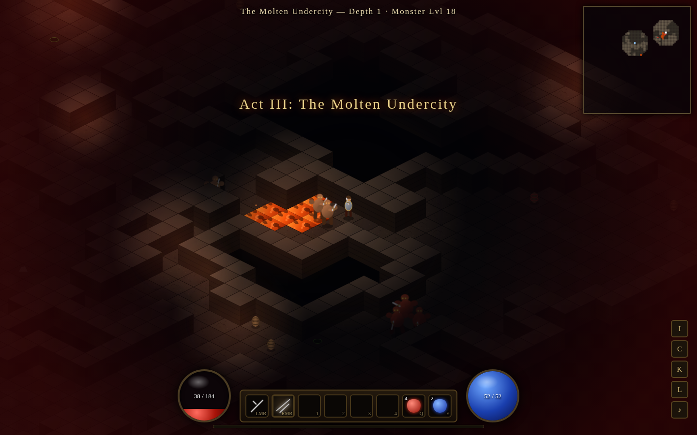
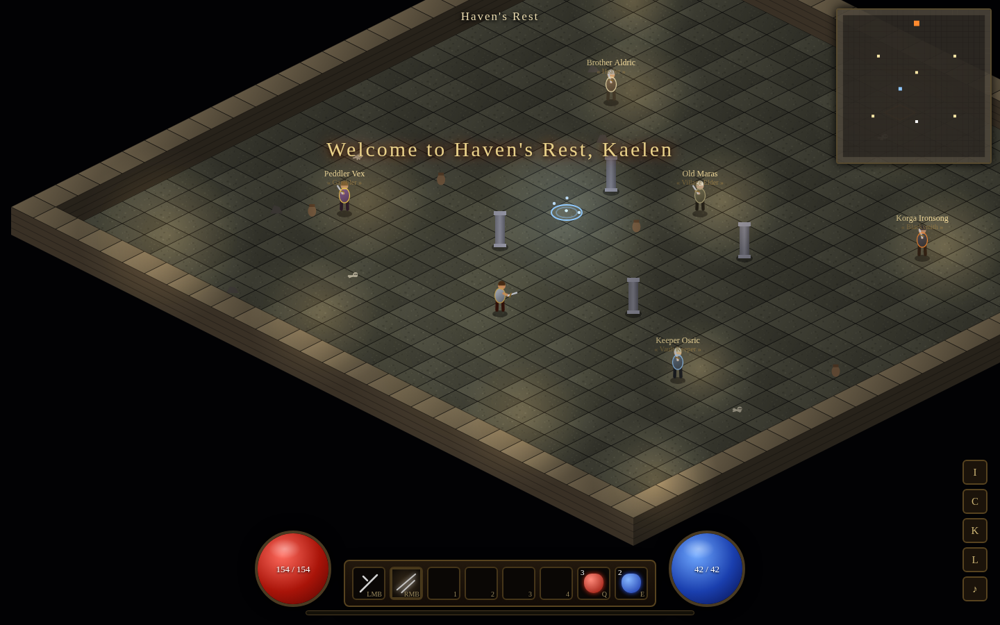

# ⚔️ DIABLOID — Ashes of the Nephalem

A complete **Diablo 2–style action RPG** that runs entirely in your browser. Zero dependencies,
zero build step, no server — just open `index.html` and descend.


## ▶️ How to play

```bash
git clone <this repo>
cd curly-enigma
# open index.html in any modern browser, or:
python3 -m http.server 8000   # then visit http://localhost:8000
```

Everything (heroes, stash, ladder standings) is saved in your browser's localStorage.

## ✨ What's inside

### 7 classes · 21 skill trees · 210 skills
Warbringer, Elementalist, Deathspeaker, Templar, Windrunner, Nightblade, Wildkeeper — each with
three themed trees of 10 skills (unlocking at levels 1/7/13/19/25, 20 ranks each). Fifteen distinct
skill archetypes power them: strikes, slams, projectiles, novas, beams, meteors, chain lightning,
summons, traps, storms, buffs, curses, dashes, passives and heals — plus stat allocation
(STR/DEX/VIT/ENE), crit, leech, resistances, +skills gear and minion scaling.


### Procedural dungeons with environmental hazards
Five acts — *The Weeping Parish, Catacombs of Ash, The Molten Undercity, The Drowned Fane,
The Burning Throne* — each procedurally generated on every visit (room-and-corridor crypts,
cellular-automata caverns), ending in a hand-crafted act boss with unique abilities and taunts.
After the fifth throne falls: **The Endless Abyss**, infinitely scaling floors for ladder pushing.

Hazards and furniture everywhere: lava lakes, spike traps, poison gas vents, exploding barrels,
treasure chests, gold piles, and six kinds of blessing shrines.



### Dynamically generated loot
Common → Magic → Rare → **Set** → **Unique**. A 46-affix pool rolls tiered prefixes/suffixes onto
19 base item types across 10 equipment slots; 25 hand-written uniques with flavor text; 7 class
sets with partial + full set bonuses. Magic find, gold find, gambling at Peddler Vex, a shared
stash vault, and a vendor who restocks to your level.


### Monsters, elites, bosses
18 monster families with distinct AI (melee, ranged, casters, summoners, chargers, suicide
bombers), champion and elite ranks with randomized affixes (Flamewreathed, Vampiric, Multishot,
Warping, Stoneskin…), generated elite names, and five multi-phase act bosses.

### Seasons & leaderboards
Quarterly seasons computed from the real calendar (*Season of Ash, Season of the Drowned Moon…*),
with three ladders: Overall, Abyss Depth, and Hardcore. Your heroes compete against a
deterministically simulated field of 2,500 rivals whose progress evolves day by day through the
season — hardcore deaths are permanent and displayed with full RIP honors.

> ⚠️ Honest fine print: this is a fully client-side game — the "other players" on the ladder are a
> deterministic simulation (same standings for everyone on the same day), not live network play.
> Real multiplayer needs a server, which a static repo can't host.


### "Pre-rendered" graphics, real-time lighting
All sprites — 7 heroes, 29 monsters, 5 bosses, NPCs, tiles for 6 tilesets — are procedurally
painted **once at load time into sprite-sheet canvases** (8 facings × 6 animation frames), then
blitted every frame like classic pre-rendered ARPGs. On top of that, a real-time pass adds:

- dynamic per-source lighting with flickering torches, colored glows and punch-out darkness
- drop shadows, elite underglows, hit-flashes, screenshake, hurt vignette
- particles for blood, embers, gas, sparks, lightning strikes, level-up bursts
- an isometric depth-sorted world with animated lava, portals and waypoints

Plus: minimap with fog of war, floating damage numbers, boss health bars, synthesized WebAudio
sound effects, town hub with 5 NPCs, town portals, waypoints, autosave, and hardcore mode.



## 🎮 Controls

| Input | Action |
|---|---|
| **WASD / arrows** | Move |
| **LMB / RMB** | Cast bound skills (aim with cursor) |
| **1–4** | Hotbar skills |
| **Q / E** | Healing / mana potion |
| **T** | Town portal |
| **I · C · K · L** | Inventory · Character · Skills · Ladder |
| **N** | Mute · **Esc** — menu |
| **Click** | Talk, loot, open, smash, activate |

Bind skills from the skill panel: click a learned skill to cycle its binding, right-click to
bind it to RMB.

## 🗂 Code layout

| File | Purpose |
|---|---|
| `js/data.js` | All content: classes, 210 skills, monsters, bosses, acts, affixes, uniques, sets |
| `js/dungeon.js` | Procedural generation: rooms, caves, hazards, spawns, the town |
| `js/sprites.js` | Bakes every sprite sheet, tile and icon to offscreen canvases at load |
| `js/entities.js` | Combat math, the 15-archetype skill engine, monster/boss AI |
| `js/render.js` | Isometric renderer, dynamic lighting, particles, minimap |
| `js/items.js` | Loot generator: affix rolls, rarities, pricing, tooltips |
| `js/ui.js` | HUD, panels, vendors, ladder simulation, main menu |
| `js/main.js` | Game state, input, save system, seasons, the loop |

*Built with vanilla JavaScript and the Canvas API. May the loot gods smile upon you.*
