# ⚔️ DIABLOID — Ashes of the Nephalem

A complete **Diablo 2–style action RPG** that runs entirely in your browser. Zero dependencies,
zero build step, no server — just open `index.html` and descend.

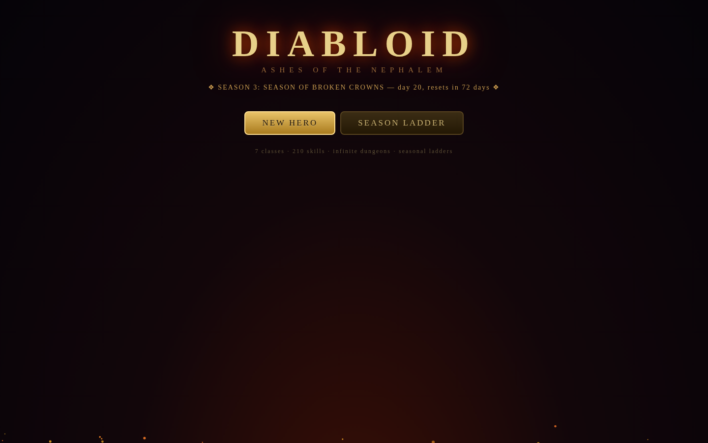

## ▶️ How to play

```bash
git clone <this repo>
cd curly-enigma
# open index.html in any modern browser, or:
python3 -m http.server 8000   # then visit http://localhost:8000
```

Everything (heroes, stash, ladder standings) is saved in your browser's localStorage.

## ✨ What's inside

### 7 classes · 21 skill trees · 210 skills
Warbringer, Elementalist, Deathspeaker, Templar, Windrunner, Nightblade, Wildkeeper — each with
three themed trees of 10 skills (unlocking at levels 1/7/13/19/25, 20 ranks each). Fifteen distinct
skill archetypes power them: strikes, slams, projectiles, novas, beams, meteors, chain lightning,
summons, traps, storms, buffs, curses, dashes, passives and heals — plus stat allocation
(STR/DEX/VIT/ENE), crit, leech, resistances, +skills gear and minion scaling.

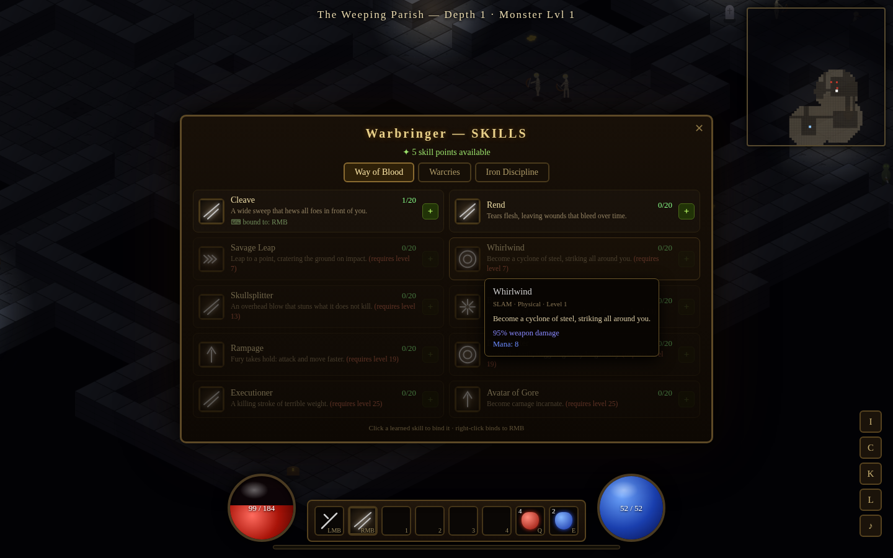

### Procedural dungeons with environmental hazards
Five acts — *The Weeping Parish, Catacombs of Ash, The Molten Undercity, The Drowned Fane,
The Burning Throne* — each procedurally generated on every visit (room-and-corridor crypts,
cellular-automata caverns), ending in a hand-crafted act boss with unique abilities and taunts.
After the fifth throne falls: **The Endless Abyss**, infinitely scaling floors for ladder pushing.

Hazards and furniture everywhere: lava lakes, still water pools, spike traps, poison gas vents,
exploding barrels, treasure chests, gold piles, and six kinds of blessing shrines.

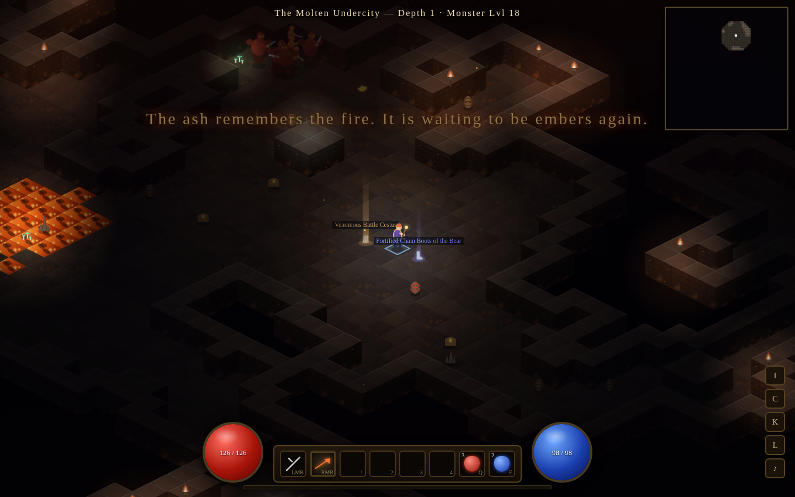
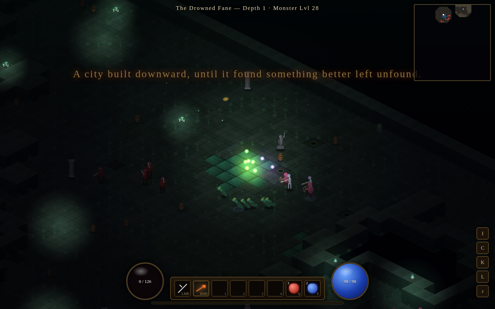

### Dynamically generated loot
Common → Magic → Rare → **Set** → **Unique**. A 46-affix pool rolls tiered prefixes/suffixes onto
19 base item types across 10 equipment slots; 25 hand-written uniques with flavor text; 7 class
sets with partial + full set bonuses. Magic find, gold find, gambling at Peddler Vex, a shared
stash vault, and a vendor who restocks to your level.

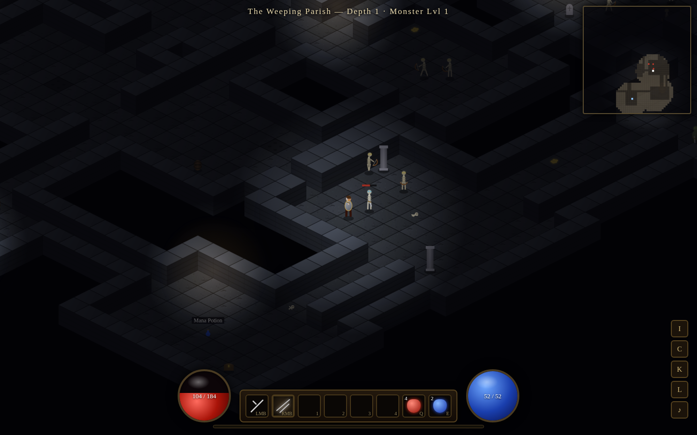

### Monsters, elites, bosses
18 monster families with distinct AI (melee, ranged, casters, summoners, chargers, suicide
bombers), champion and elite ranks with randomized affixes (Flamewreathed, Vampiric, Multishot,
Warping, Stoneskin…), generated elite names, and five multi-phase act bosses.

### Seasons & leaderboards
Quarterly seasons computed from the real calendar (*Season of Ash, Season of the Drowned Moon…*),
with three ladders: Overall, Abyss Depth, and Hardcore. Your heroes compete against a
deterministically simulated field of 2,500 rivals whose progress evolves day by day through the
season — hardcore deaths are permanent and displayed with full RIP honors.

> ⚠️ Honest fine print: this is a fully client-side game — the "other players" on the ladder are a
> deterministic simulation (same standings for everyone on the same day), not live network play.
> Real multiplayer needs a server, which a static repo can't host.

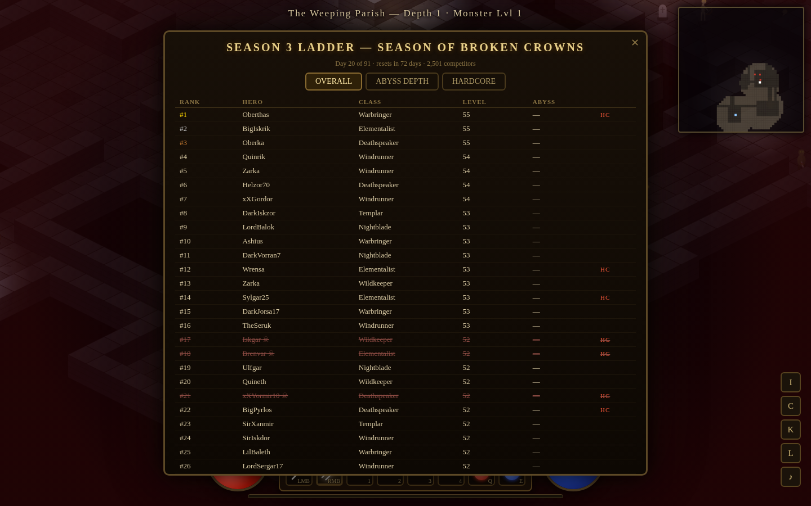

### "Pre-rendered" graphics, real-time lighting
All sprites — 7 heroes, 29 monsters, 5 bosses, NPCs, tiles for 6 tilesets — are procedurally
painted **once at load time into sprite-sheet canvases** (8 facings × 6 animation frames, tiles
supersampled at 2× on hi-DPI displays), then blitted every frame like classic pre-rendered
ARPGs. On top of that, a real-time pass adds:

- dynamic per-source lighting with flickering torches, colored glows and punch-out darkness
- **volumetric god rays** falling from cracks in the unseen ceiling, with dust motes in the beam
- **drifting atmospheric fog**, tinted and lit per tileset, plus per-theme color grading & vignette
- **baked ambient occlusion** where floors meet walls, beveled hi-res masonry per theme
  (slabs, brick courses, cobbles, magma-veined hellstone) with moss, cracks and mineral glints
- **animated liquids** — churning 4-frame lava and still water that *reflects the actors standing
  in it*, with travelling specular glints and ripple rings
- **directional soft shadows** cast away from the nearest light source, sharpening near the flame
- Diablo-style **rarity light pillars** over dropped loot, sparkling on uniques and sets
- a living prop population: torch sconces and braziers with layered living flames, statues,
  banners, cobwebs, candle clusters, skull piles, glowing crystals and bioluminescent mushrooms,
  stalagmites, gravestones, swaying trees
- per-theme ambient particle fields: crypt dust, cavern embers, fane spores, hellish falling ash,
  fireflies over the town pond
- particles for blood, embers, gas, sparks, lightning strikes, level-up bursts
- an isometric depth-sorted world with animated portals and waypoints
- an automatic quality governor that quietly sheds the priciest layers on weak hardware

Plus: minimap with fog of war, floating damage numbers, boss health bars, synthesized WebAudio
sound effects, town hub with 5 NPCs, town portals, waypoints, autosave, and hardcore mode.

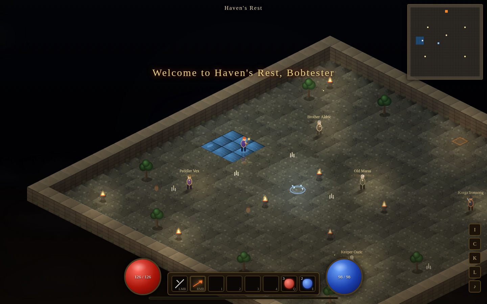
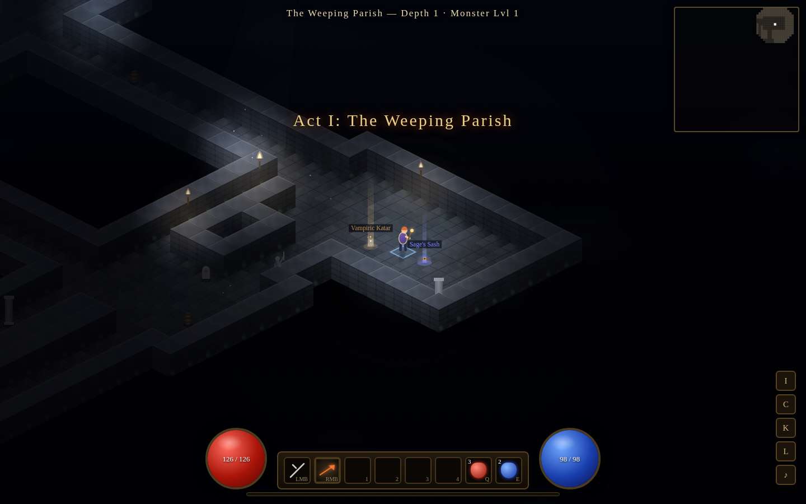
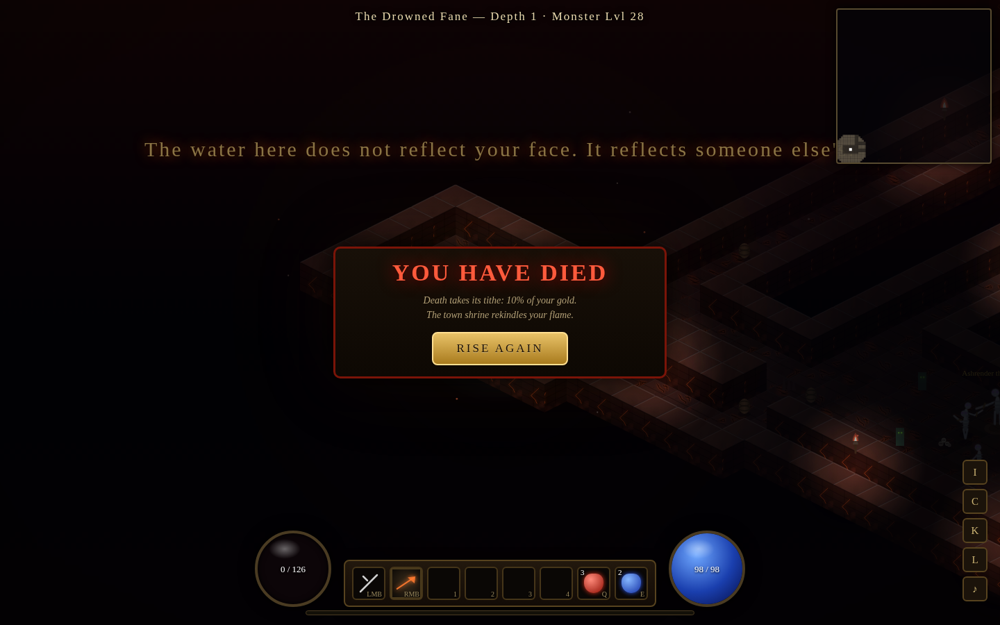

### A full WoW-style interface — every frame movable
The HUD is a complete MMO-grade interface layer, and **every frame can be dragged anywhere**
via Edit Mode (layout persists between sessions):

- **Programmable action bar** — LMB/RMB plus ten keybound slots. Pick skills up from the skill
  tree and drop them on any slot; slots take skills, potions or macros, and show radial cooldown
  sweeps, out-of-mana tinting and charge counts.
- **Unit frames** — player frame (portrait, health/mana/XP), **target frame** with rank-colored
  names, elite affixes and live **status-effect icons with timers**, and a **party frame** for
  your summoned minions with health and remaining-duration bars.
- **Enemy nameplates** — health bars, names and debuff icons (stun/slow/burn/curse/weaken) over
  monsters in the world; "always show nameplates" toggle included.
- **Incoming & outgoing combat text** — two independent scrolling streams for damage taken and
  dealt, with crit emphasis and potion heals.
- **Damage meter** — rolling DPS, per-fight totals, best hit, damage-taken rate, and a
  per-source breakdown (skills, minions, damage-over-time) with percentage bars.
- **Chat frame** — timestamped tabs (All / Combat / Loot / System) fed by kills, rare+ drops,
  pickups, quests and season events, plus slash commands: `/help`, `/played`, `/dps`, `/editui`,
  `/resetui`, `/macro`, `/dance`.
- **Quest log & tracker** — 18 quests (act clears, boss hunts, level & Abyss milestones, shrine
  and treasure goals) with gold/XP rewards, an on-screen objective tracker and a `J` log panel.
- **Buff tray** — blessings and skill auras beside the minimap with icons, countdown timers,
  names and stat tooltips.
- **Settings** — six tabs: Gameplay, Audio (master volume), Video (quality pin/auto + individual
  toggles for fog, god rays, AO, reflections, grading, FPS counter), Interface (show/hide any
  frame, Edit Mode, reset layout), **Keybinds** (every action rebindable, click-to-capture) and
  **Macros** (priority or cast-sequence skill chains, draggable onto the bar).

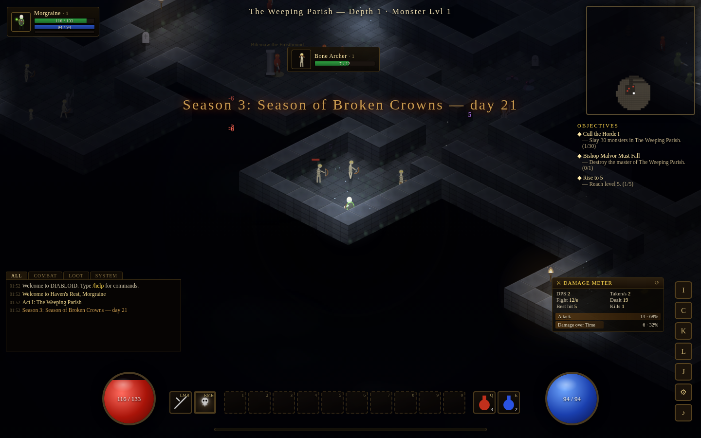
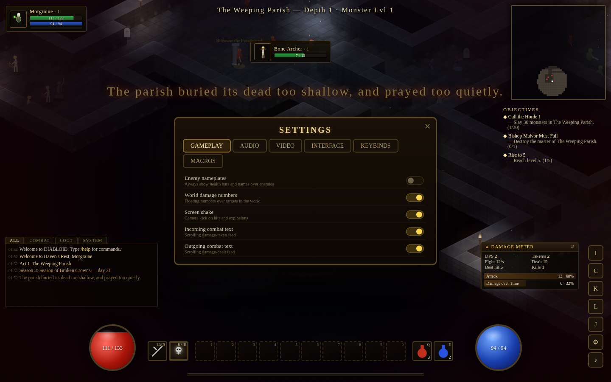
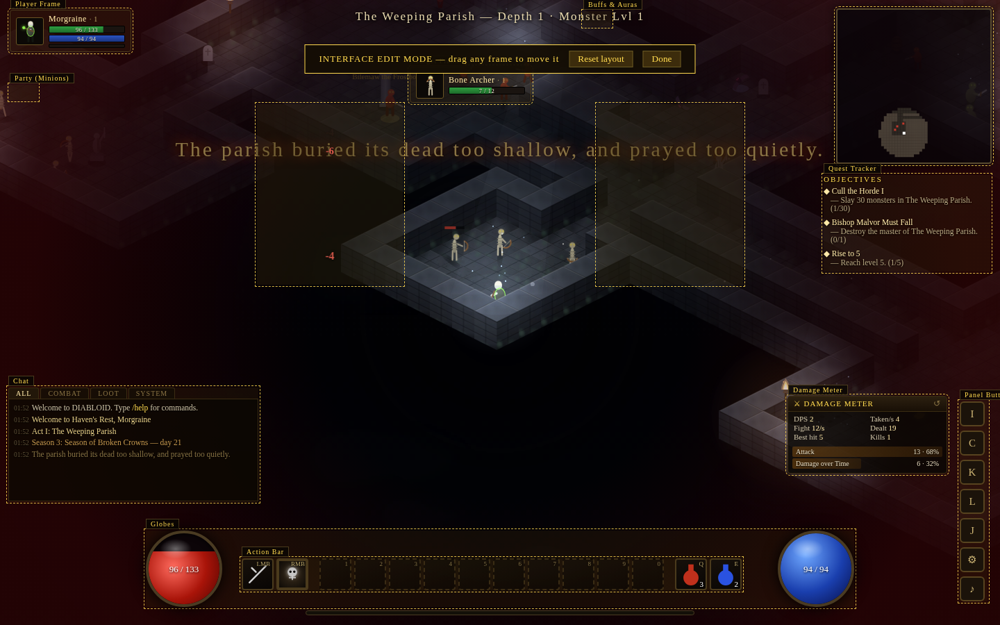

### Cameras, physics and a real human figure
Two perspectives, a rigid-body layer, and an articulated body that wears what you equip.

**Adjustable camera** — switch between the classic **Isometric** view and a **Third Person**
camera that swings in behind your hero and follows their facing. Both perspectives expose
independent, persisted settings:

- **Zoom** 0.55×–2.8× on the mouse wheel, the `+`/`-` keys or a settings slider
- **Pitch**, from near top-down to a low, horizon-heavy angle
- **Free yaw rotation** — `[` and `]` rotate the world; iso snaps to 90°, third person turns
  smoothly and auto-swings behind you after a manual nudge
- **Follow distance** and **turn speed** for the third-person rig
- Walls between the camera and your hero **fade out** so a low angle never boxes you in

Pre-rendered diamond tiles stay pixel-correct at any yaw: the camera matrix
`P(zoom,pitch) · R(yaw) · P(1,0.5)⁻¹` maps the baked art into the rotated view, and walls become
true extrusions — ground corners projected, lifted, with only the camera-facing quads drawn.
The whole floor pass runs under a single transform.

**Physics** — smashed props throw chunks that arc, tumble, bounce off floors and walls, skid to a
stop under friction, splash in water and burn up in lava. Corpses **ragdoll** along the blow that
killed them. Explosions apply radial impulses to debris, corpses and loose props alike, and
materials (wood, stone, clay, bone, metal, glass, cloth) each have their own restitution and drag.

**Human figure** — the old stick sprite is gone. Every humanoid is now a jointed skeleton —
pelvis, spine, neck, head, upper and forearms, thighs and shins — posed by an animation state
machine with a contralateral walk cycle, a faster run, windup/strike/recover attacks, casting,
flinches, deaths and dances. The hero is drawn live rather than from a sheet, so **equipment is
visible**: your helm (with visor, crest and horns at higher rarities), chest plate and pauldrons,
cape, belt buckle, gloves, boots and your actual weapon — sword, axe, mace, spear, bow, crossbow,
staff, wand, dagger or orb — all coloured by the item's rarity and glowing if it's a set or unique.

**Props & fixtures** — roughly triple the prop density and 30+ types: crates, sarcophagi,
bookshelves, chandeliers, weapon racks, anvils, cauldrons, tables, chairs, sacks, pots, lanterns,
wellheads and ore veins. Many are **interactive**:

| Fixture | What it does |
|---|---|
| **Lever** | Grinds open a hidden cache of loot nearby |
| **Unlit brazier** | Light it — it becomes a permanent light source |
| **Ore vein** | Mine it for gold, several charges deep |
| **Bookshelf** | Search it for hidden items or coin |
| **Fountain** | Drink to heal and gain Fountain's Vigor |
| **Crates, pots, urns, sacks** | Smash them into physics debris, sometimes loot |

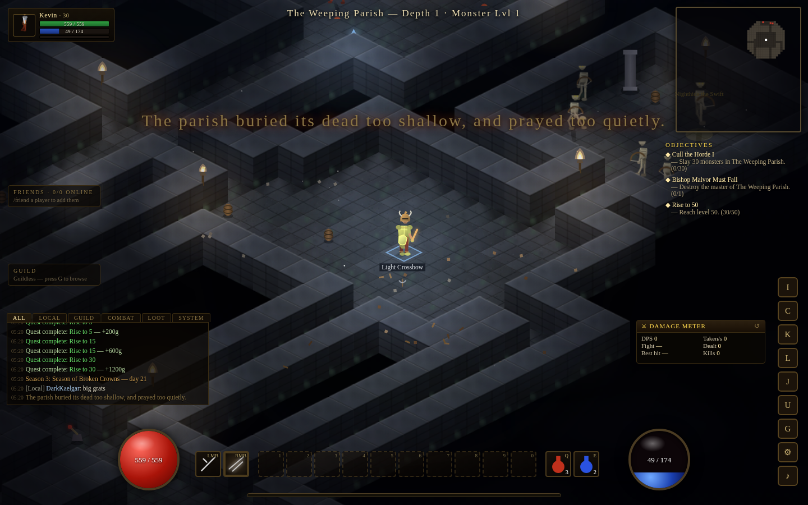
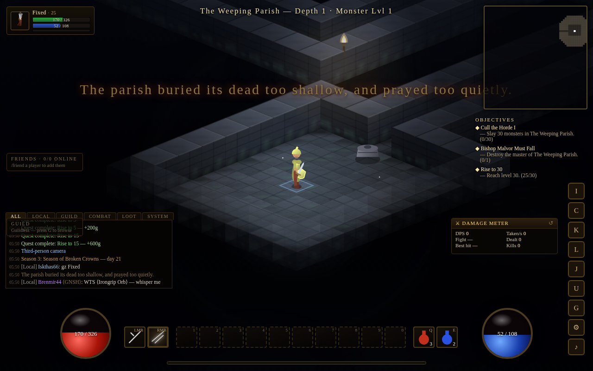
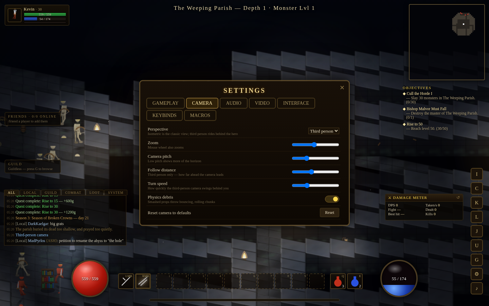

### A living social world — friends, guilds, chat, emotes
Haven's Rest is now populated: simulated players (the same personalities that fill the season
ladder) walk the town, chatter, and react to what you do.

- **Friends system** — `/friend` players, see them in a movable Friends frame with online status,
  and get login/logout alerts. Whisper from the Social panel with one click.
- **Guild system** — browse five recruiting guilds or found your own for 2,500 gold. Guild tag on
  your player frame, roster with ranks (Guild Master / Officer / Member / Initiate), editable
  MOTD (`/gmotd`, Guild Master only), a movable Guild frame, and a green guild chat channel.
- **Chat channels** — Local and Guild tabs join the chat frame; `/w` private messages get
  personality-driven replies (traders, helpers, memers, grinders, recruiters, lorekeepers),
  `/r` answers the last whisper, `/who` lists who's around. Other players congratulate your
  level-ups, boss kills and unique drops.
- **Mute & block** — `/mute` hides a player's chat; `/block` also rejects their whispers. Manage
  both from the Social panel (U).
- **Emotes & dances** — 13 emotes (`/wave /bow /cheer /laugh /roar /flex …` — see `/emotes`) and
  `/dance`, which spins your character with musical notes; townsfolk sometimes dance along.
- **Chat & emote bubbles** — speech bubbles over your character and simulated players in the
  world (toggleable in Settings → Interface).
- **Special nameplates** — notable players carry colored names: gold ★GM, purple MVP, teal
  Veteran — plus guild tags and levels on every player nameplate.
- **Command list** — `/help` in the chat window lists everything.

> ⚠️ Same honest fine print as the ladder: there is no server, so the "other players" are a
> deterministic client-side simulation — consistent, chatty, occasionally helpful, never real.

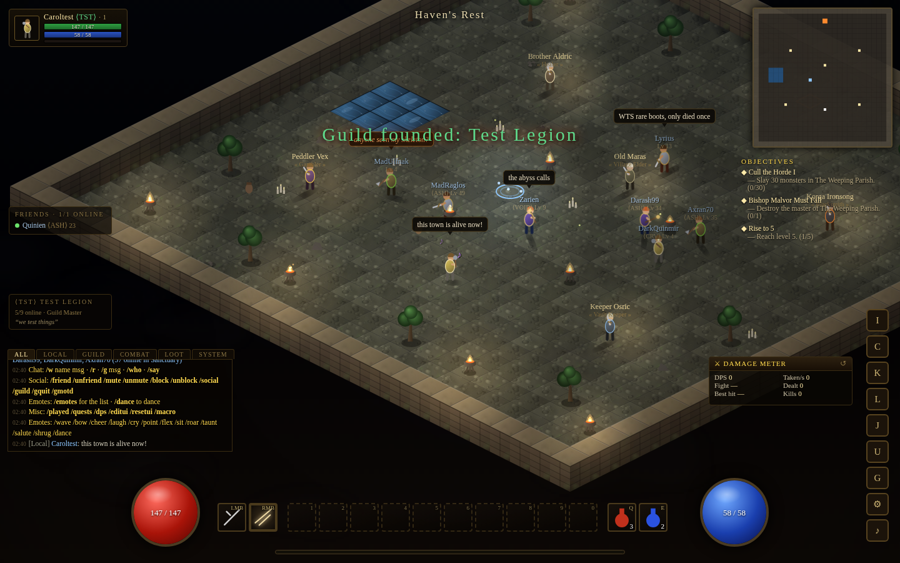
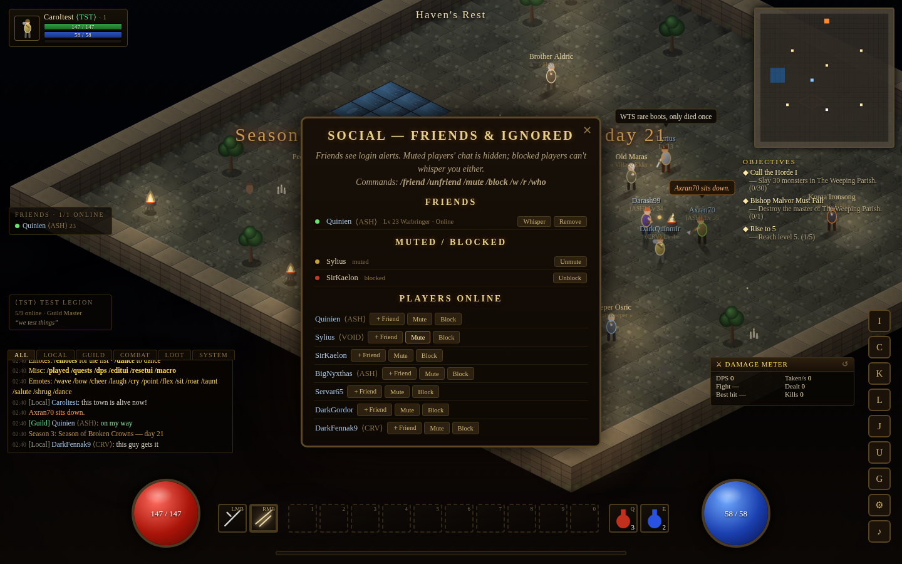
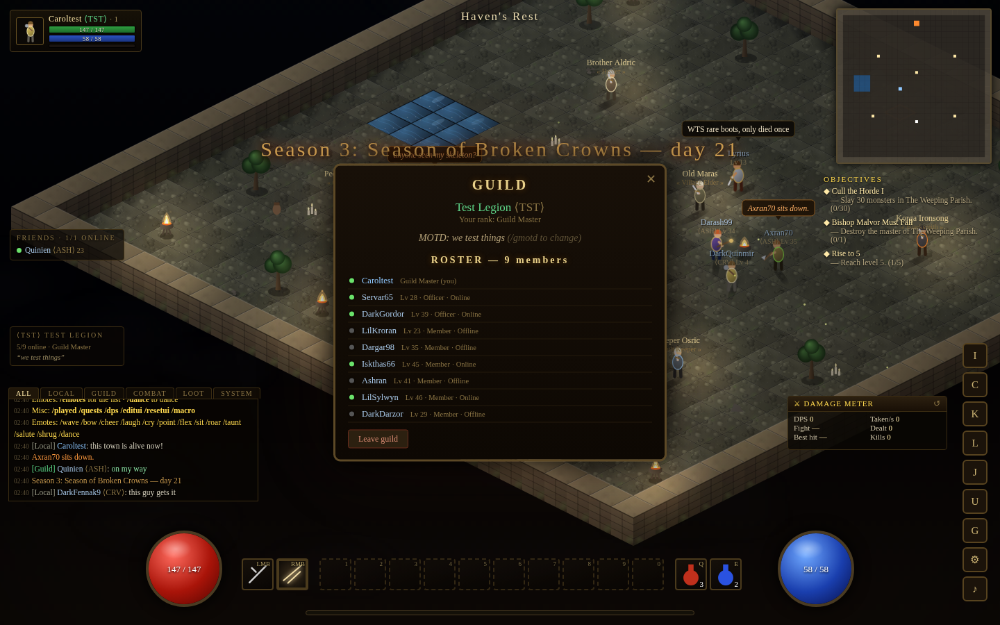

## 🎮 Controls (defaults — everything rebindable in Settings → Keybinds)

| Input | Action |
|---|---|
| **WASD / arrows** | Move |
| **LMB / RMB** | Cast bound skills (aim with cursor) |
| **1–0** | Action bar slots |
| **Q / E** | Healing / mana potion |
| **T** | Town portal |
| **I · C · K · L** | Inventory · Character · Skills · Ladder |
| **J · O** | Quest log · Settings |
| **U · G** | Social (friends) · Guild |
| **V** | Toggle isometric / third-person camera |
| **[ · ]** | Rotate camera · **wheel / + · -** — zoom |
| **Enter** | Chat (`/help` for commands) |
| **N** | Mute · **Esc** — menu |
| **Click** | Talk, loot, open, smash, activate |

Bind skills WoW-style: click a learned skill in the skill tree to pick it up, then drop it on
any action bar slot (right-click a slot to lift its contents; right-click a skill to bind RMB).

## 🗂 Code layout

| File | Purpose |
|---|---|
| `js/data.js` | All content: classes, 210 skills, monsters, bosses, acts, affixes, uniques, sets |
| `js/dungeon.js` | Procedural generation: rooms, caves, hazards, spawns, the town |
| `js/sprites.js` | Bakes every sprite sheet, tile and icon to offscreen canvases at load |
| `js/entities.js` | Combat math, the 15-archetype skill engine, monster/boss AI |
| `js/render.js` | Isometric renderer, dynamic lighting, particles, minimap |
| `js/items.js` | Loot generator: affix rolls, rarities, pricing, tooltips |
| `js/ui.js` | HUD, panels, vendors, ladder simulation, main menu |
| `js/main.js` | Game state, input, save system, seasons, the loop |

*Built with vanilla JavaScript and the Canvas API. May the loot gods smile upon you.*
